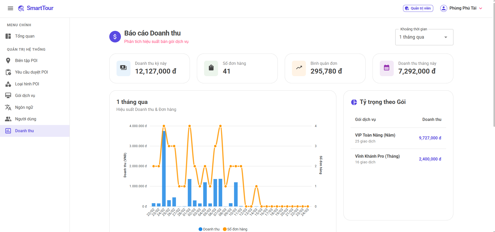
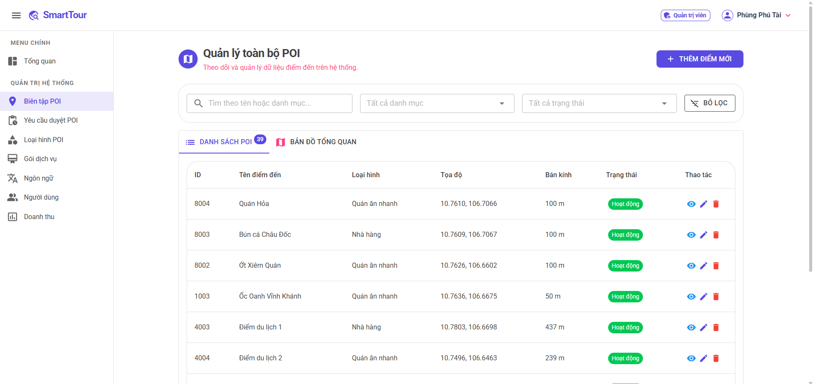
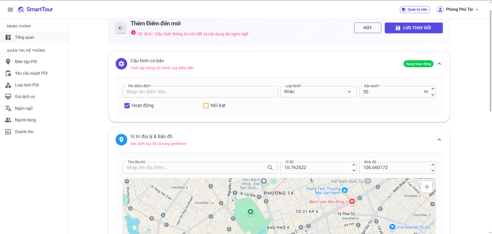
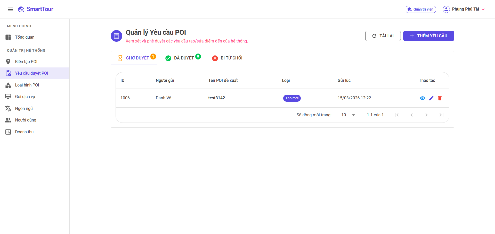

# SmartTour (.NET 8 Solution)

SmartTour là hệ sinh thái nền tảng du lịch thông minh, được thiết kế và phát triển thông qua ngôn ngữ C# trên nền tảng .NET 8. Hệ thống được xây dựng theo kiến trúc phân tách rõ ràng, hướng tới cung cấp trải nghiệm tốt nghiệm cho cả khách du lịch (Visitors) và đơn vị vận hành (Administrators/Sellers).

## 📱 Giao diện Mobile App Demo

<div align="center">
  
  
  
  
</div>
## 💻 Giao diện Web Admin

<div align="center">
  
  
</div>
<br>
<div align="center">
  
  
</div>

<br>

## 🏗️ Kiến Trúc Hệ Thống (System Architecture)

Giải pháp áp dụng mô hình kiến trúc phân lớp (N-Tier Architecture) và chia tách Project trên .NET Solution, hướng tới tối ưu hóa tái sử dụng mã nguồn (Code Sharing) giữa hệ thống Web và Mobile. Quá trình phát triển tận dụng triệt để hệ sinh thái .NET 8:

1. **SmartTour.Shared:** Thư viện dùng chung chứa các Entity Models, Data Transfer Objects (DTO) và các Helpers tiện ích. Đóng vai trò là cấu trúc dữ liệu trung tâm định hình Database và giao tiếp API.
2. **SmartTour.API:** Backend RESTful API (ASP.NET Core Web API) xử lý logic nghiệp vụ, tích hợp dịch vụ bên thứ ba (Third-party integrations) và tương tác với cơ sở dữ liệu.
3. **SmartTour.Web:** Hệ thống quản trị nội dung (CMS) xây dựng bằng Blazor Server, dành cho quản trị viên và đối tác.
4. **SmartTour.Mobile:** Ứng dụng di động đa nền tảng (Android/iOS) phát triển trên MAUI Blazor Hybrid.

## 📂 Tổ Chức Thư Mục (Project Structure)

```text
SmartTour/
├── SmartTour.Shared     # Common Models & Transfer Objects
├── SmartTour.API        # Trung tâm xử lý Logic & Database
├── SmartTour.Web        # Admin Dashboard & Partner Portal 
└── SmartTour.Mobile     # Ứng dụng Mobile Client 
```

## 🚀 Các Chức Năng Chính (Core Modules)

### 1. Phân Hệ Backend API (`SmartTour.API`)
- **Quản lý dữ liệu lõi:** CRUD dữ liệu về Cụm điểm tham quan (POIs), Ngôn ngữ (Languages), Danh mục (Categories) và Gói dịch vụ.
- **Hệ thống TTS & Biên dịch:** Tự động gọi API dịch thuật (Translate) và chuyển đổi văn bản thành giọng nói (Text-to-Speech) đa ngôn ngữ.
- **Duyệt POI Request (Crowdsourcing):** Cung cấp workflow duyệt các điểm tham quan do người dùng/đối tác đề xuất.
- **Quản trị Tài chính & Đăng ký (SaaS):** Xử lý luồng Gói dịch vụ (Service Packages) và Đăng ký (Subscriptions), ghi nhận doanh thu từ bên thứ ba (Web).

### 2. Phân Hệ Web Admin CMS (`SmartTour.Web`)
- **Interactive Dashboard:** Bảng điều khiển giám sát hệ thống, theo dõi POIs và thống kê doanh thu (Revenue) từ Gateway PayOS.
- **Phân quyền Role-based:** Hệ thống quản trị dựa trên Cookie Authentication phân biệt rõ ràng Role Admin và Seller.
- **Quản trị POIs:** Tích hợp bộ tùy chỉnh bản đồ (*Mapbox / Google Maps*) để định tuyến và ghim tọa độ trực quan trên UI.
- **Quản lý Media:** Quản lý quy trình Upload hình ảnh/âm thanh lên Google Cloud Storage bảo mật.

### 3. Phân Hệ Mobile App (`SmartTour.Mobile`)
- **Offline-First Data Sync:** Giám sát lưu lượng và đồng bộ toàn bộ siêu dữ liệu POIs (JSON/SQLite), Media (Local AppData) và Maps (Cache API) xuống thiết bị. Cho phép khám phá khi hoàn toàn mất mạng.
- **Smart Geofencing:** Chạy tác vụ theo dõi vị trí GPS ngầm. Tự động phát âm thanh (Auto-play Audio) khi bước vào bán kính của một điểm tham quan.
- **Bản đồ Offline Custom Protocol:** Hỗ trợ xem vị trí mượt mà không cần mạng nhờ vào MapLibre GL JS + Carto Voyager HD kết nối qua local intercept protocol.
- **Tương tác quét mã (QR Scanner):** Cung cấp công cụ quét mã tích hợp trực tiếp camera điện thoại để định vị thông tin nhanh.

## 🛠️ Công Nghệ & Thư Viện Sử Dụng (Tech Stack)

### Backend & Database
- **Framework:** .NET 8.0 Minimal APIs & Controllers.
- **ORM:** Entity Framework Core (SQL Server gốc & SQLite cho Mobile).
- **Xác thực:** JWT Bearer & Authentication Cookies. Tích hợp Social Login (Google Authentication).
- **Thanh toán:** PayOS Payment Gateway.

### Frontend (Web & Mobile)
- **Công nghệ lõi UI:** Blazor Server / Blazor WebView (MAUI).
- **Giao diện & UI Toolkits:** MudBlazor Components.
- **Tích hợp Bản đồ:** Google Maps JS API, MapLibre GL JS.

## ⚙️ Hướng Dẫn Cài Đặt (Setup Instructions)

### Bước 1: Yêu Cầu Môi Trường
- Tải và cài đặt [.NET 8.0 SDK](https://dotnet.microsoft.com/download/dotnet/8.0).
- Khuyến nghị sử dụng Visual Studio 2022 v17.8+ (Workloads: `ASP.NET & Web`, `.NET MAUI`).
- Một hệ quản trị CSDL hỗ trợ SQL Server (SQL Server Express hoặc Docker).

### Bước 2: Cấu Hình Biến Môi Trường
Đổi tên tệp `.env.example` thành `.env` nằm tại thư mục gốc của Solution và điền đầy đủ các thông tin API keys:
```env
MAP_PROVIDER=Google                # hoặc Mapbox
MAPBOX_ACCESS_TOKEN=pk.[token]
GOOGLE_MAP_API_KEY=AIzaSy...
GOOGLE_CLIENT_ID=[id].apps.googleusercontent.com
PAYOS_CLIENT_ID=[client_id]
PAYOS_API_KEY=[api_key]
PAYOS_CHECKSUM_KEY=[checksum_key]
```

### Bước 3: Build & Khởi tạo CSDL
Tại thư mục chứa dự án API, chạy EF migrations để cập nhật cấu trúc schema:
```bash
cd SmartTour.API
dotnet ef database update
```

### Bước 4: Chạy Hệ Thống
Hệ thống sử dụng cơ chế liên kết API-Client. 
- Mở **Visual Studio**, nhấp chuột phải vào Solution -> Chọn `Configure Startup Projects`.
- Click `Multiple startup projects` và đặt cờ **Start** cho hai project sau:
  - `SmartTour.API`
  - `SmartTour.Web` (Để khởi chạy Cổng Quản Trị) hoặc `SmartTour.Mobile` (Để khởi chạy Android/Windows App Emulator).
